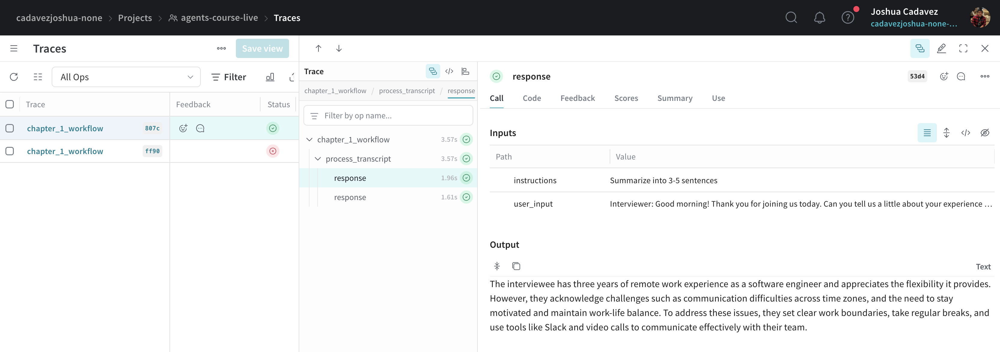
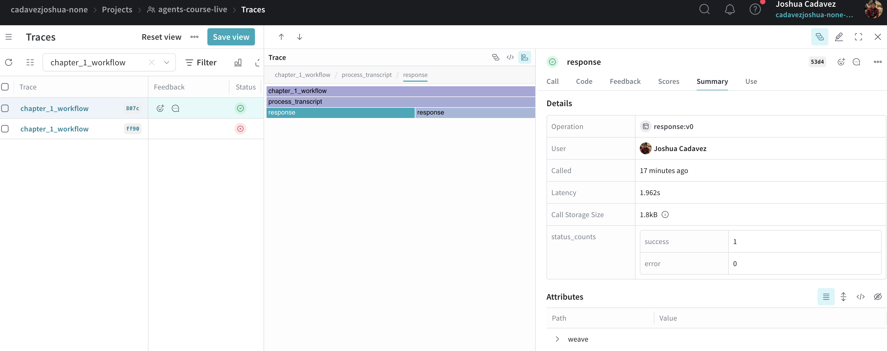

# AI Engineering: Agents

Learned about AI Agents via [Weights and Biases platform tutorial](https://site.wandb.ai/courses/agents/).

## _1_workflow.py

Demonstrates chaining in AI workflows. A *chain* is a sequence of predetermined LLM calls.

This script is a practical example of a chain that:
1. Takes a transcript and generates a summary using one LLM call
2. Takes that summary and analyzes its tone using a second LLM call

