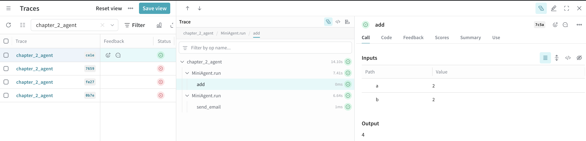
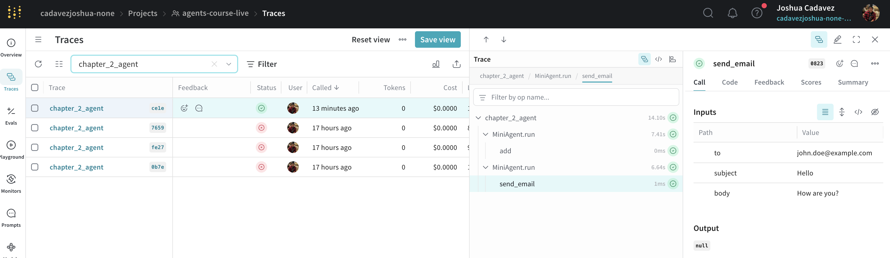

# AI Engineering: Agents

Learned about AI Agents via [Weights and Biases platform tutorial](https://site.wandb.ai/courses/agents/).

## _1_workflow.py

Demonstrates chaining in AI workflows. A *chain* is a sequence of predetermined LLM calls.

This script is a practical example of a chain that:
1. Takes a transcript and generates a summary using one LLM call
2. Takes that summary and analyzes its tone using a second LLM call


## _2_agent.py

Demonstrates the use of an **AI agent** to solve tasks with dynamic decision-making. Unlike chains, agents can choose which tools or actions to use at each step based on the current context.

```
% python _2_agent.py
weave: Logged in as Weights & Biases user: cadavezjoshua.
weave: View Weave data at https://wandb.ai/cadavezjoshua-none/agents-course-live/weave
weave: 🍩 https://wandb.ai/cadavezjoshua-none/agents-course-live/r/call/01983d7e-dc1a-7ce5-ba74-7989d882ce1e
Input: What is 2 + 2?
4
[reasoning       ] 
[function_call   ] add({"a": "2", "b": "2"})
[function_output ] 4
[message         ] The result of 2 + 2 is 4.[endmessage      ] 
Input: Send an email to John Doe with the subject 'Hello' and body 'How are you?'
[reasoning       ] 
[function_call   ] send_email({"to": "john.doe@example.com", "subject": "Hello", "body": "How are you?"})
Sending email to john.doe@example.com with subject Hello and body How are you?
[function_output ] null
[message         ] Your email has been sent to John Doe.[endmessage      ] 
```

This script shows:
1. How an agent receives a user query and determines the best sequence of actions to answer it.
2. The agent may use multiple tools (e.g., LLM calls, external APIs) and adapt its workflow as needed.
3. All steps, decisions, and results are tracked and visualized in the Weights & Biases dashboard.

**Key concepts:**  
- Agents vs. chains: Agents are flexible and can change their approach dynamically.
- Tool usage: Agents select tools/actions at runtime.
- Experiment tracking: All agent actions are logged for analysis and reproducibility.



